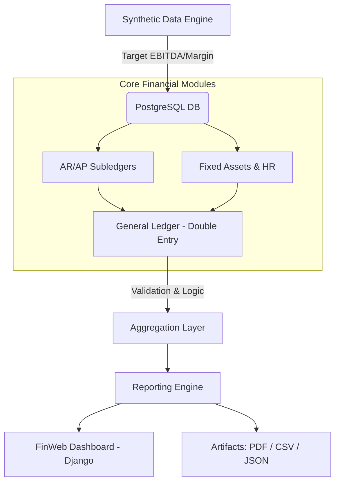

# ERP-Style Financial Analytics & Data Modeling Engine
> **Full-Stack Financial Data Engineering & ERP Simulation**


## Overview

A comprehensive full-stack ERP simulation designed to model complex financial data flows, multi-entity accounting logic, and automated statutory/management reporting.

**TL;DR:** A full-stack ERP simulation engine for synthetic financial data, ledger posting, and automated reporting with Django/Bokeh dashboards.

---

## The Virtual Company (VC) Model
The engine simulates a global IT services conglomerate with complex revenue streams:

* **Business Structure:** 6 subsidiaries, 3 Lines of Business (Managed Services, System Integration, Consulting).
* **Revenue Models:** Hardware (one-off), SaaS/PaaS (One-off and subscriptions), and Consulting (hourly).
* **Cost Tracking:** Management of Profit Centers, Cost Centers, and **WBS (Work Breakdown Structure)** codes for R&D capitalization.

---

## Technical Architecture

The system utilizes a modular pipeline architecture to transform targeted financial objectives into a structured relational database and a web-based reporting interface.





1. Deterministic Synthetic Data Generation

This module bypasses standard randomization in favor of goal-oriented data engineering. The Python-based logic reverse-engineers transactions based on targeted EBITDA and Gross Margin parameters, ensuring the generated dataset adheres to specific financial performance benchmarks for testing.

2. High-Integrity Ledger Logic

The system implements robust Double-Entry Bookkeeping principles. It features automated posting logic from AR (Accounts Receivable) and AP (Accounts Payable) sub-ledgers to the General Ledger. The schema is built on 33+ normalized PostgreSQL tables with strict referential integrity (PK/FK) to prevent data corruption.

3. Automated ETL & Reporting Pipeline

The project features a "One-Click" deployment capability. Utilizing Python and Shell scripting, the engine automates database migrations, transaction ingestion, month-end accruals, depreciation, and the generation of multi-format reporting artifacts (PDF, CSV, JSON).

## Technical Stack

* **Languages**: Python (Pandas, NumPy), SQL, Shell Scripting.
* **Database**: PostgreSQL (33 tables with strict constraints).
* **Web Framework**: Django (FinWeb Dashboard).
* **Visualization**: Bokeh & Django-integrated reporting views.

## Capabilities & Reports

    The engine generates the following standardized financial outputs:

*  **Statutory**: Balance Sheet and P&L (VC Consolidated).

*  **Management**: P&L segmented by 4 Business Units, 3 Cost Centers, and 3 Lines of Business.

*  **Operational**: AR aging reports and Product Development capitalization summaries via WBS codes.

## Environment & Dependencies

This project is developed within a dedicated virtual environment to ensure dependency isolation, security, and reproducibility across different development environments.

### Installation
```bash
# Clone the Repository
git clone [https://github.com/Myname/ERP-Financial-Analytics-Engine.git](https://github.com/Myname/ERP-Financial-Engine.git)
cd ERP-Financial-Engine

# Create and activate virtual environment on Fedora
python3 -m venv venv
source venv/bin/activate

# Install core financial and data dependencies
pip install -r requirements.txt
```

### Execution
Run the master script to build the database, post ledger entries, and generate reporting artifacts:
```bash
# One-click run: End-to-end database build to financial reports with visualizationBuild the entire financial environment
python finweb/manage.py runserver
```
### Accessing the Results
The FinWeb dashboard serves as the visualization layer for the underlying ERP engine.

* **URL**: [http://127.0.0.1:8000](http://127.0.0.1:8000)
* **Authentication**: Interactive; the `run_engine.sh` script will prompt for your database password in the terminal (secure input).

### Sample Results

